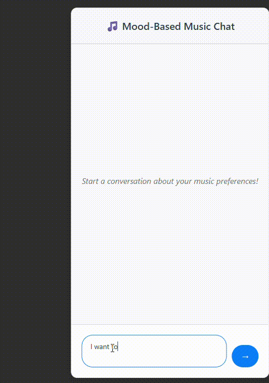
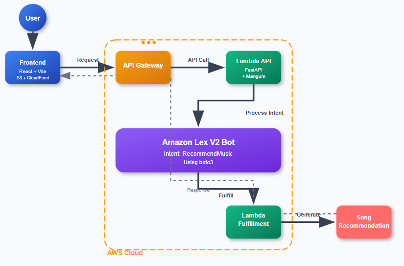

# 🎧 Mood-Based Music Recommender

A serverless chatbot that understands user intent and recommends music based on their mood. Built with **AWS Lex**, **Lambda**, **FastAPI**, **React + Vite**, and deployed using **AWS CDK**, **S3**, and **CloudFront**.

This project is designed as a portfolio piece to showcase chatbot development, serverless backend integration, and frontend deployment using modern AWS services.

---

## ✨ Demo



---

## 🧠 Features

* Conversational bot using **AWS Lex v2**
* Mood detection and music recommendation
* Backend using **FastAPI** + **Mangum** to call Lex from REST endpoint
* Lambda function for **Lex fulfillment**
* Deployed with **AWS CDK**
* Frontend built with **React + Vite**
* Hosted using **S3** and **CloudFront**
* CI-ready structure

---

## 📦 Tech Stack

| Layer       | Tech                   |
| ----------- | ---------------------- |
| Chatbot     | AWS Lex V2             |
| Fulfillment | AWS Lambda (Python)    |
| API Gateway | FastAPI + Mangum       |
| Frontend    | React + Vite           |
| Deployment  | AWS CDK (Python)       |
| Hosting     | Amazon S3 + CloudFront |

---

## 🗺️ Architecture



---

## 🚀 How to Run Locally

### 🧱 Prerequisites

* AWS CLI configured
* Node.js & Python 3.8+
* CDK installed: `npm install -g aws-cdk`

### 🔨 Setup

```bash
# Clone the repo
git clone https://github.com/yourusername/mood-based-music-recommender.git
cd mood-based-music-recommender

# Bootstrap AWS CDK
cdk bootstrap

# Deploy backend resources
cdk deploy

# Frontend
cd frontend
npm install
npm run dev
```

---

## 🧠 Intent Design

* **Intent:** `GetMusicRecommendation`
* **Slot:** `mood` (happy, sad, etc.)
* **Utterances:** "Suggest a song for me", "I am in a happy mood", etc.

---

## ✅ To-Do / Improvements

* [ ] Add more moods and song options
* [ ] Power it using a recommendation incorporating user history
* [ ] Use GenAI to improve conversation experience
* [ ] Improve UI
* [ ] Add logging/monitoring via CloudWatch
* [ ] CI/CD integration using GitHub Actions
* [ ] Unit tests for Lambda

---
**Tushar Sable**
[GitHub]((https://github.com/Tu9harSa6le)) | [LinkedIn](www.linkedin.com/in/tusharsable13)

---


---
